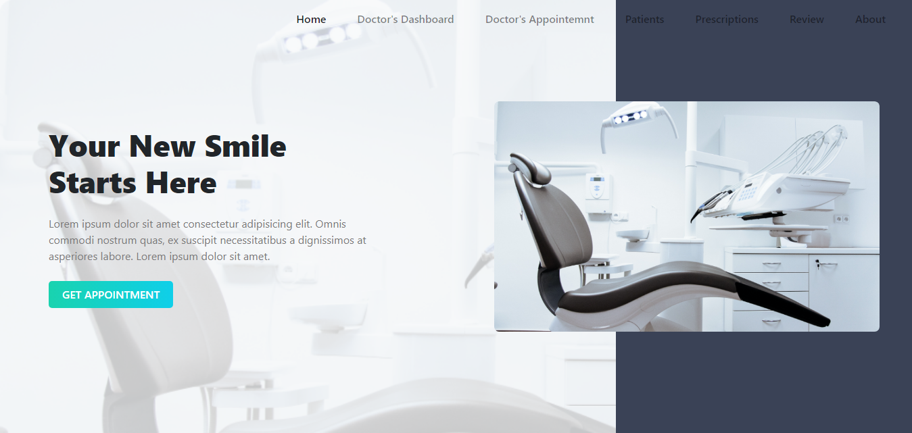
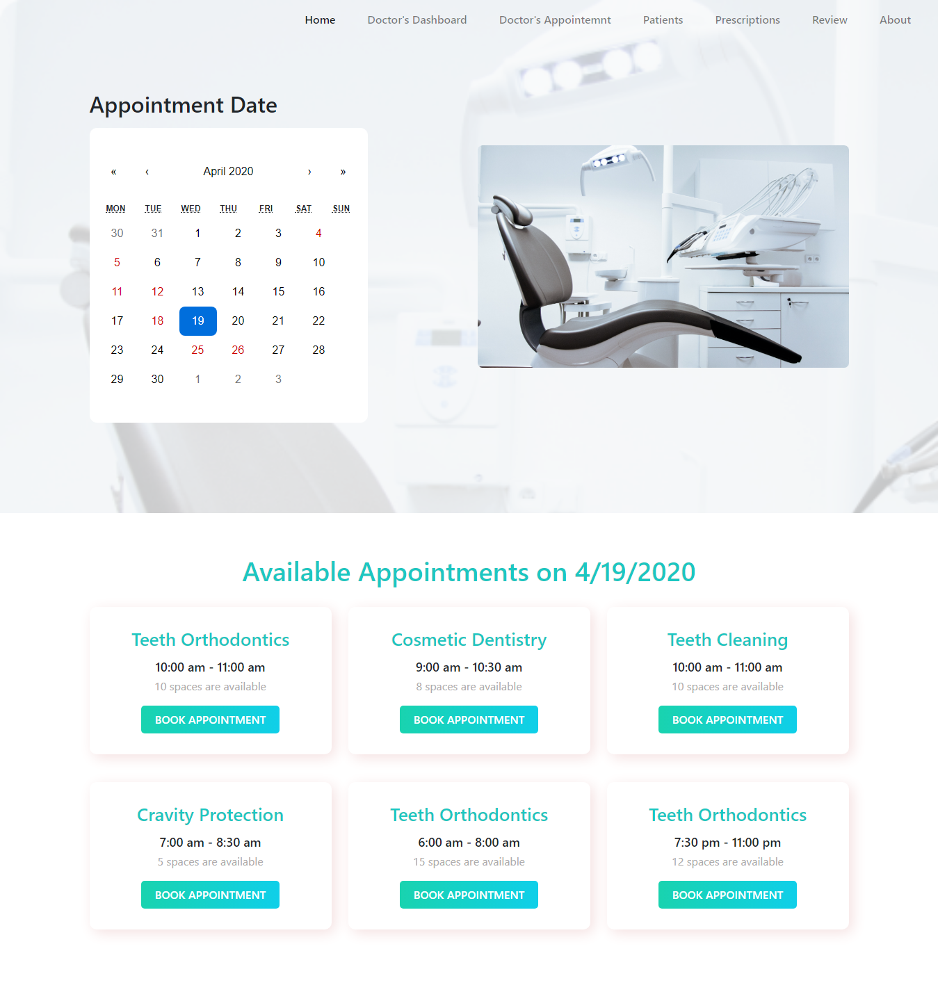

# DENTISTS PORTAL

It's a simple hospital management system which Client Side managed with React.js & bootstrap.

## What's included
 - Every Patients could get Appointment on his selected date on Calender.
 - Displayed patient's selected date & treatment in Appointment Form using state.
 - After submitting appointment, patient redirected to homepage.
 - In Doctor's Dashboard, Doctors can see all his appointments.
 - In Doctor's Appointment, Doctor can see all his appointments by selecting date on calender.
 - In Patients page, All the patients showed.
 - In Prescriptions page, All the doctor's prescriptions displayed.
 - Tried to dynamically manage event handling keeping UX in mind. 
 - Backend API managed express.js
 - Used MongoDB as Database.

## Installation
### Prerequisites
In order to install DENTISTS PORTAL, the following prerequisites must be installed:
 - NPM 
 - Git

### Download
1. Open your command line and run:
```js
$ git clone https://github.com/nazmul98/dentists-portal-client.git
```

### Installation Process
In order to install, the following steps must be taken:

1. Open your command line, go to the extracted folder and run:
```js
$  npm install
$  npm start
```

                    **Congratulations, you have installed Dentist Portal App!**

### How I built it
The web application backend is built on express.js. Data is stored in a MongoDB database. The application will be hosted on firebase. React.js, JS ES6 features, Bootstrap4, HTML5 and CSS3 is used in the front-end.

### Useful Links
 - Demo: https://dentists-portal.web.app/
 - Server: https://github.com/nazmul98/dentists-portal-server

### Screenshots
 
 
 
 